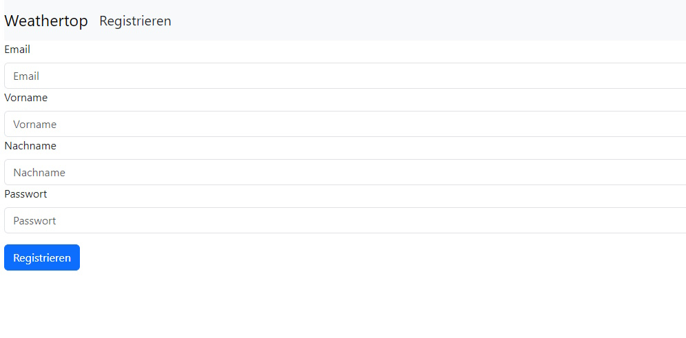
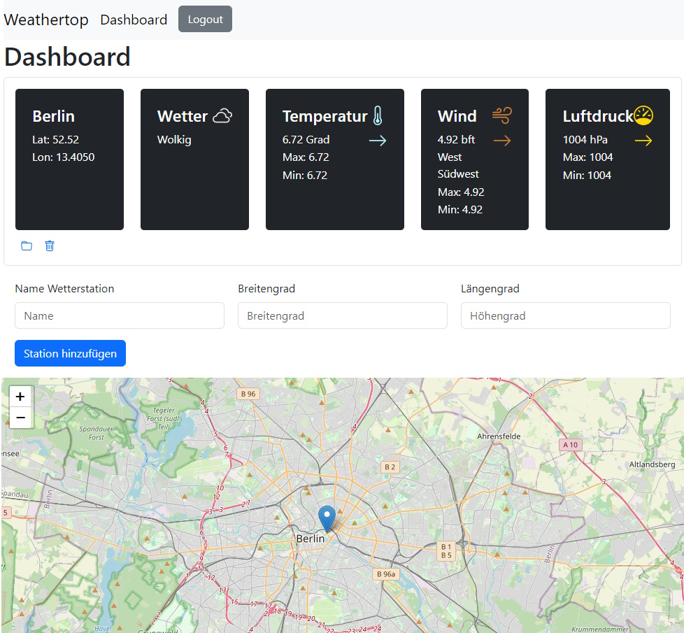
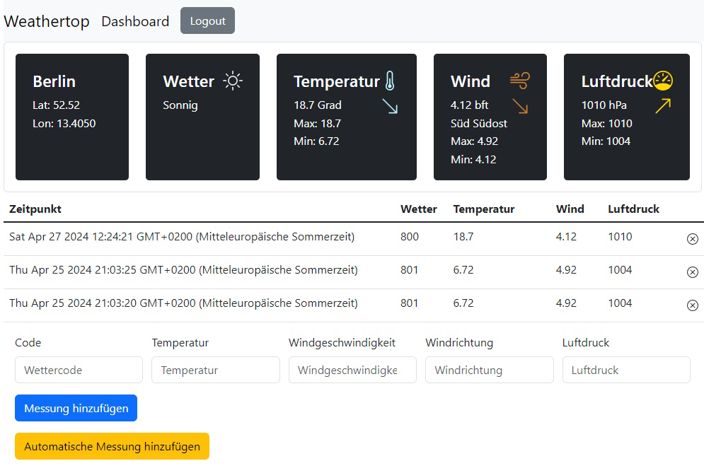

# Weathertop

Save weather stations from all over the world and take accurate weather readings from them with Weathertop. 

## Table of Contents

- [Overview](#overview)
- [About the Project](#about-the-project)
    - [Built With](#built-with)
- [Getting Started](#getting-started)
    - [Prerequisites](#prerequisites)
    - [Installation](#installation)
- [Usage](#usage)

## Overview

  
The homepage users will see when first visiting the website. It allows users to login to their accounts or go to a signup page to create a new account.

  
The signup page allows users to create a new user-account.

  
Users will be sent to the dashboard after a successfull login into their accounts. There they can see their saved weather station with information about the most recent weather reading they made from it. In the station card they can also delete the station or go to its specific site to create new readings.  
Below the stations, new ones can be added using a name an the coordinates of the place where it is located at. A map also allows you to see where all of your stations are around the globe.

  
On the weather station page the users can see the six most recent readings as well as create a manual reading or an automatic reading. Automatic readings gather their information from the OpenWeatherMap API.  

## About the Project

Weathertop is a responsive web application that allows its users to save weather stations, using the coordinates of the place they want to track, to their account. After logging in they can view all their saved stations or add new ones. Upon clicking on a stations, a user can see the history of past readings they made, or create new ones with the simple click of a button.  

### Built With

- Frontend:
    - HTML5 (with Pug)
    - CSS3
    - JavaScript
    - Bootstrap
- Backend:
    - Node.js
    - Express.js
- Database:
    - PostgreSQL
- Package Management:
    - npm

## Getting Started

### Prerequisites

A local installation of *PostgreSQL* with an installed Database Tool, like *DBeaver*.  
The newest LTS release of *Node.js* with the package manager *npm*. 

### Installation

1. Download the Project on GitHub
2. Setup PostgreSQL Database:  
    - sequentially use the SQL commands in your Database Tool. This will create a new database with the required tables and a new role exclusive to this database that allows you to connect on the database and add to the tables.
3. Navigate to the project folder in your terminal/command-line
4. Install the node modules using the following command: **npm install**

## Usage

1. Navigate to the project folder in your terminal/command-line
2. Start the Node.JS server using the following command: **node app.js**
3. Open your webbrowser
4. Type the following address into the searchbar: **localhost:3000**
